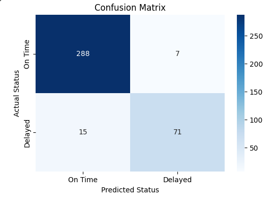

# Airline Flight Delay Predictor


A machine learning project that predicts the probability of an airline flight delay using historical flight data. This model uses a **Logistic Regression** algorithm to classify flights as either "On Time" or "Delayed".

---

## 📋 Table of Contents
- [Project Overview](#project-overview)
- [Features](#features)
- [Installation and Setup](#installation-and-setup)
- [How to Use](#how-to-use)
- [Model Evaluation](#model-evaluation)
- [Future Improvements](#future-improvements)

---

## ✈️ Project Overview

Flight delays have a significant impact on both passenger travel plans and airline operations. This project aims to provide a predictive tool that can estimate the likelihood of a flight delay before its scheduled departure. By training a logistic regression model on historical data features like **`Carrier`** and **`DepTime`**, we can provide a probability score for potential delays.

---

## ✨ Features

- **Data Preprocessing:** Cleans and prepares the data by handling categorical and time-based features.
- **Model Training:** Utilizes a Logistic Regression model from Scikit-learn to learn patterns from the historical data.
- **Prediction:** Provides a real-time prediction of a flight's status (On Time or Delayed) along with a delay probability.
- **Evaluation:** Includes model accuracy and a confusion matrix to assess performance.
- **Interactive CLI:** A simple command-line interface to get predictions for new, unseen flights.

---

## 🚀 Installation and Setup

To run this project locally, follow these steps:

1. **Clone the repository:**
   ```bash
   https://github.com/adityagoswami004/Airline-Flight-Delay-predictor.git
   
   ```

2. **Create and activate a virtual environment (recommended):**
   ```bash
   # For Windows
   python -m venv venv
   .\venv\Scripts\activate

   # For macOS/Linux
   python3 -m venv venv
   source venv/bin/activate
   ```

3. **Install the required dependencies:**
   ```bash
   pip install -r requirements.txt
   ```

---

## USAGE How to Use

Once the setup is complete, you can run the main script:

```bash
python predictor.py
```
The script will first train the model and display the evaluation metrics. To use the interactive prediction interface, uncomment the final line (`start_cli_interface()`) in `predictor.py` and run the script again.

Follow the on-screen prompts to enter a carrier and departure time to get a prediction.

---

## 📊 Model Evaluation

The model was evaluated on the training dataset and achieved the following results:

- **Accuracy:** 93%
-  **Confusion Matrix:**

  

This indicates a strong performance in correctly identifying both delayed and on-time flights.

---

## 💡 Future Improvements

- **Add More Features:** Incorporate additional data points such as weather conditions, flight routes, and airport traffic to potentially increase model accuracy.
- **Experiment with Other Models:** Test more complex algorithms like Gradient Boosting or Random Forest to see if they can capture more nuanced patterns.
- **Deploy as a Web App:** Create a user-friendly web interface using Streamlit or Flask to make the predictor more accessible.
